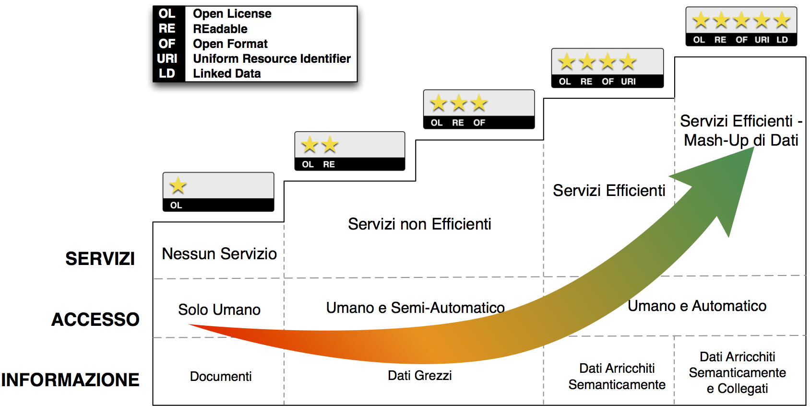
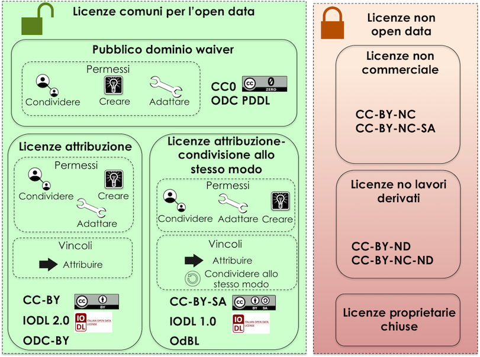
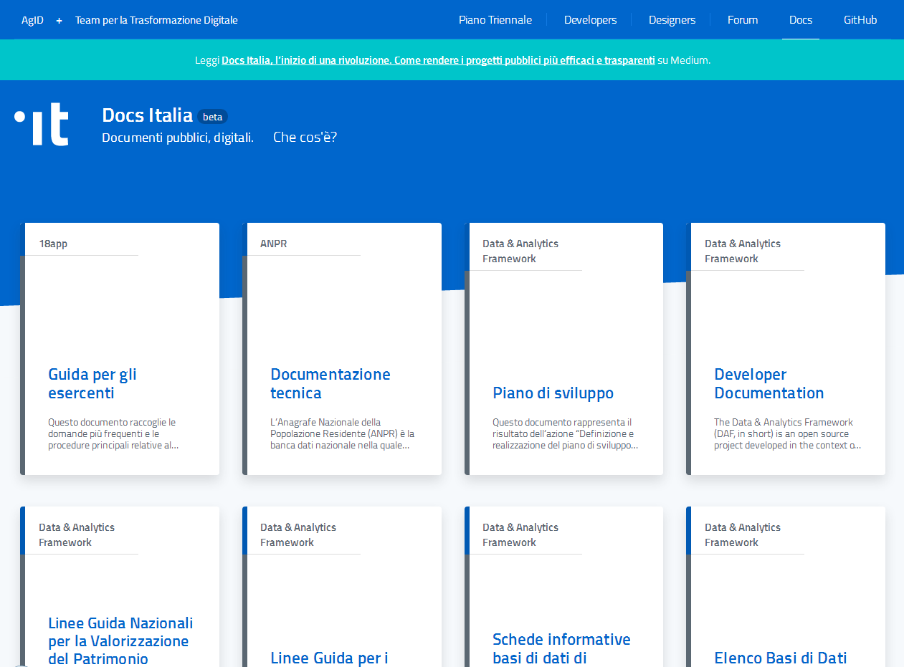
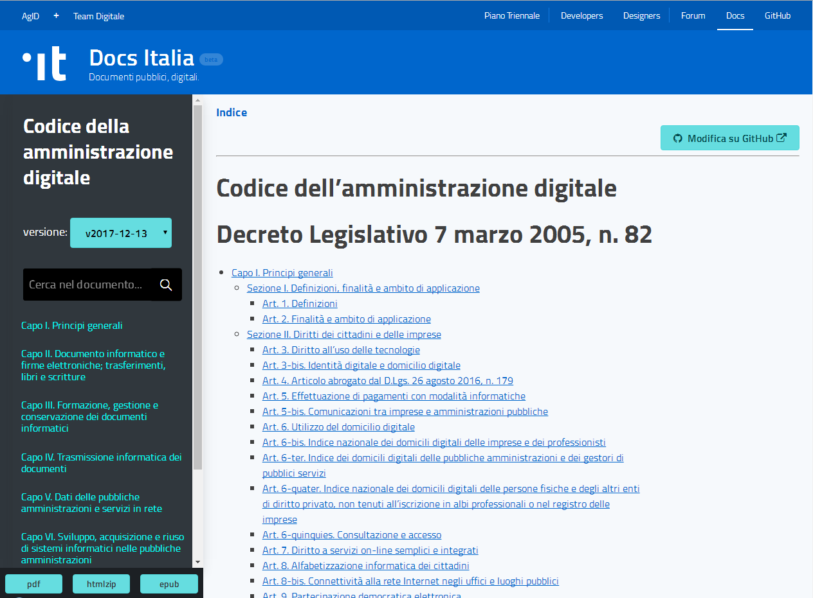
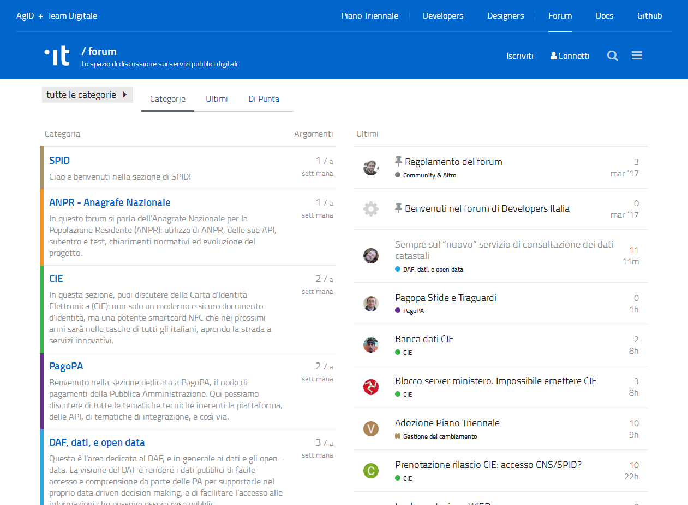

**Linee Guida Open Data**

|Stemma Città Metropolitana di Napoli| *Città Metropolitana di Napoli*

**Linee Guida Open Data**

**Autore: Ufficio Relazioni con il Pubblico**

**Data di rilascio:**

+----------------+-------------------------------------+
| **Proprietà:** | Città Metropolitana di Napoli - URP |
+----------------+-------------------------------------+

+----------+------------+-----------------------------------------+----------------------------------------+
| Versione | Data       | Descrizione                             | Autore                                 |
+==========+============+=========================================+========================================+
| 1.0      | 21/04/2018 | **Linee Guida Open Data**               | Ufficio Relazioni con il Pubblico – pp |
+----------+------------+-----------------------------------------+----------------------------------------+
| 1.1      |            | **Dati geografici**                     | Sit - Sistema Informativo Territoriale |
|          |            |                                         |                                        |
|          |            | **metadatazione per dati territoriali** |                                        |
+----------+------------+-----------------------------------------+----------------------------------------+

Quest'opera è distribuita con Licenza CC BY SA 4.0 - Creative Commons Attribuzione - Condividi allo stesso modo 4.0 Internazionale.

|image1|

`INTRODUZIONE E PRINCIPI 3 <#introduzione-e-principi>`__

`Funzione delle Linee Guida 3 <#funzione-delle-linee-guida>`__

`Principi 3 <#_1t3h5sf>`__

`Open Government 5 <#open-government>`__

`Obiettivi 5 <#obiettivi>`__

`Durata e Validità 5 <#durata-e-validità>`__

`NORMATIVA DI RIFERIMENTO 6 <#normativa-di-riferimento>`__

`Normativa Italiana 6 <#normativa-italiana>`__

`Normativa Europea 7 <#normativa-europea>`__

`Normativa Internazionale cui aderisce lo Stato Italiano 8 <#normativa-internazionale-cui-aderisce-lo-stato-italiano>`__

`FARE OPEN DATA 9 <#fare-open-data>`__

`I dati delle Pubblica Amministrazione 9 <#i-dati-delle-pubblica-amministrazione>`__

`Aprire i dati della P.A. 9 <#_1pxezwc>`__

`Modello di dati per i dati aperti 11 <#modello-di-dati-per-i-dati-aperti>`__

`Livelli del modello per i dati aperti 11 <#_23ckvvd>`__

`Censimento 13 <#censimento>`__

`Metadatazione 13 <#_41mghml>`__

`Profilo nazionale per i metadati DCAT-AP_IT 14 <#_2grqrue>`__

`La Piattaforma web degli open data 19 <#_vx1227>`__

`Il Portale Ckan 20 <#il-portale-ckan>`__

`Caratteristiche Principali 20 <#caratteristiche-principali>`__

`Modalità di produzione dei dataset e formato di pubblicazione 20 <#modalità-di-produzione-dei-dataset-e-formato-di-pubblicazione>`__

`ORGANIZZAZIONE PER LE ATTIVITÀ SUGLI OPEN DATA 22 <#organizzazione-per-le-attività-sugli-open-data>`__

`Articolazione degli Uffici 22 <#_206ipza>`__

`Formazione 24 <#formazione>`__

`Attività di monitoraggio e ruolo degli indicatori 24 <#attività-di-monitoraggio-e-ruolo-degli-indicatori>`__

`Licenza per il riutilizzo 24 <#licenza-per-il-riutilizzo>`__

`DOCUMENTAZIONE DIGITALE 26 <#_1rvwp1q>`__

`Perché? 26 <#_4bvk7pj>`__

`I Principi 26 <#principi-1>`__

`Docs Italia ha queste caratteristiche: 27 <#docs-italia-ha-queste-caratteristiche>`__

`Accessibilità e mobile first 27 <#_kgcv8k>`__

`La partecipazione 28 <#la-partecipazione---discourse>`__

`Linguaggio e formati usati 29 <#la-partecipazione-hypothes.is>`__

`NOTA FINALE 29 <#_xvir7l>`__

`RIFERIMENTI 30 <#riferimenti>`__

`CREDITS 30 <#credits>`__

INTRODUZIONE E PRINCIPI
=======================

Funzione delle Linee Guida
--------------------------

La Città Metropolitana di Napoli nel rispetto della normativa vigente Comunitaria, Nazionale e Regionale, intende dotare la propria organizzazione di criteri di trasparenza ed efficienza, individuando nell’Open Government il percorso per una P.A. aperta nei confronti dei cittadini e delle imprese; gli elementi imprescindibili di questa strategia sono rappresentati dagli Open Data.

Le **Linee Guida**, di cui al presente documento, costituiscono il primo documento necessario alla costituzione di processi e politiche favorevoli alla valorizzazione del patrimonio informativo, agevolando in questo modo la realizzazione di un Pubblica Amministrazione capace di favorire la democrazia partecipativa, agevolare la raggiungibilità dei dati e promuovere lo sviluppo dell’economia.

Le presenti Linee Guida si propongono di:

1. illustrare i concetti di open data;

2. descrivere procedure per la raccolta, la catalogazione e la pubblicazione dei dati posseduti dall’amministrazione secondo formati “\ *standard aperti*\ ”, così come previsto nel documento della Commissione Europea:“\ *European Interoperabilty Framework*\ ”;

3. Indicare delle figure strategiche all’interno dell’Ente responsabili del processo di pubblicazione e gestione degli Open Data;

4. Individuare le licenze al fine di consentire il riutilizzo dei dati;

Principi
--------

Alcune definizioni dei principi cardine di queste Linee Guida sono:

-  “\ **Governo Aperto**\ ” (Open Government): "*la trasparenza delle azioni di governo, l'accessibilità dei servizi e delle informazioni pubbliche e la capacità di risposta del governo alle nuove idee, alle esigenze ed alle necessità*" [1]_;

-  “\ **Amministrazione Digitale**\ ” (E-Government) si intende (secondo la definizione data dalla Banca Mondiale): “\ *L'uso da parte di agenzie governative di tecnologie informatiche che hanno la capacità di trasformare le relazioni con i cittadini, con le imprese e con altri rami di governo. Queste tecnologie possono servire una moltitudine di scopi differenti: una migliore erogazione dei servizi pubblici per i cittadini, interazioni fra le imprese e l'industria, responsabilizzazione dei cittadini attraverso l'accesso alle informazioni, o una più efficiente gestione dell’attività governativa. I vantaggi che ne derivano possono essere individuati in una minore corruzione, una maggiore trasparenza, maggiori vantaggi ed opportunità, crescita dei ricavi e/o di riduzione dei costi*";

-  “\ **Dato Aperto**\ ” (o Dati Aperti, Open Data) si intende (secondo la `definizione data nel progetto Open Definition della Open Knowledge Foundation <http://opendefinition.org/>`__): “\ *un contenuto o un dato si definisce aperto se chiunque è in grado di utilizzarlo, ri-utilizzarlo e ridistribuirlo, soggetto, al massimo, alla richiesta di attribuzione e condivisione allo stesso modo*\ ”;

-  **“Standard Aperto”** si intende quello standard disponibile pubblicamente con diversi diritti ad esso associati, e con diverse proprietà con cui è stato progettato (secondo la `definizione riportata su it.wikipedia.org <https://it.wikipedia.org/wiki/Standard_aperto>`__).

Uno standard si considera “aperto” quando (`secondo le prescrizioni fornite dall'Unione Europea nel documento European Interoperability Framework -EIF- <http://ec.europa.eu/idabc/en/document/2319/5644.html>`__):

-  *è adottato e mantenuto da un’organizzazione non-profit ed il cui sviluppo avviene sulle basi di un processo decisionale aperto e a disposizione di tutti gli interlocutori interessati e le cui decisioni vengono prese per consenso o a maggioranza;*

-  *il documento di specifiche è disponibile liberamente oppure ad un costo nominale. Deve essere possibile farne copie, riusarle e distribuirle liberamente senza alcun costo aggiuntivo;*

-  *eventuali diritti di copyright, brevetti o marchi registrati sono irrevocabilmente concessi sotto forma di royalty-free;*

-  *non è presente alcun vincolo al riuso, alla modifica e all’estensione dello standard.*

**Il**\ `CAD - Codice dell’Amministrazione Digitale <https://cad.readthedocs.io>`__ (D.L. 82/2005 e successive modifiche ed integrazioni) contiene indicazioni per la documentazione digitale:

`Art. 7. Diritto a servizi on-line semplici e integrati <http://cad.readthedocs.io/it/v2017-12-13/_rst/capo1_sezione2_art7.html#art-7-diritto-a-servizi-on-line-semplici-e-integrati>`__

Chiunque ha diritto di fruire dei servizi erogati dai soggetti di cui all’articolo 2, comma 2, in forma digitale e in modo integrato, tramite gli strumenti telematici messi a disposizione dalle pubbliche amministrazioni e il punto di accesso di cui all’articolo 64-bis, anche attraverso dispositivi mobili.

`Art. 9. Partecipazione democratica elettronica <http://cad.readthedocs.io/it/v2017-12-13/_rst/capo1_sezione2_art9.html#art-9-partecipazione-democratica-elettronica>`__

I soggetti di cui all’articolo 2, comma 2, favoriscono ogni forma di uso delle nuove tecnologie per promuovere una maggiore partecipazione dei cittadini, anche residenti all’estero, al processo democratico e per facilitare l’esercizio dei diritti politici e civili e migliorare la qualità dei propri atti, anche attraverso l’utilizzo, ove previsto e nell’ambito delle risorse disponibili a legislazione vigente, di forme di consultazione preventiva per via telematica sugli schemi di atto da adottare.

**I principi elencati rappresentano gli elementi fondanti di un’azione che valorizza il patrimonio informativo dei dati, attivando la trasparenza dell’attività Amministrativa come elemento imprescindibile per l’innovazione e lo sviluppo economico e sociale del territorio.**

Open Government
---------------

La Città Metropolitana di Napoli individua nel paradigma dell’Open Government la strada per creare una P.A. aperta, che dia vigore all’innovazione nei confronti di cittadini ed imprese: gli Open Data rappresentano i capisaldi di tale strategia.

Il principio fondamentale degli Open Data è che i dati pubblici, nel rispetto della normativa vigente, appartengono alla collettività e come tali devono essere ri-utilizzabili da chiunque ne abbia interesse.

Attraverso la pubblicazione degli Open Data la Città Metropolitana di Napoli valorizza il proprio patrimonio informativo e:

-  favorisce la democrazia partecipativa rendendo i cittadini maggiormente consapevoli della realtà in cui vivono e consente loro di effettuare scelte che soddisfino i bisogni della collettività;

-  agevola la raggiungibilità dei dati, rendendo disponibili una elevata quantità di dati e documentazione che di solito sono difficilmente reperibili;

-  riattiva lo sviluppo dell'economia in quanto consente alle imprese e ai singoli di creare nuove applicazioni di interesse per la collettività.

Obiettivi 
----------

Le Linee Guida adottate dalla Città Metropolitana di Napoli, pertanto, hanno lo scopo di:

1. disciplinare criteri e modalità di individuazione di dati e di documenti all'interno delle strutture dell’amministrazione che possono essere oggetto di pubblicazione e riutilizzo;

2. regolamentare modalità di gestione e di aggiornamento dei dati;

3. descrivere l’organizzazione adottata dall’ente all'interno delle proprie strutture al fine della pubblicazione e aggiornamento dei dati;

4. descrivere le licenze adottate dall’Ente al fine di consentire il riutilizzo dei dati e dei documenti di cui l'amministrazione abbia titolarità, o di cui abbia disponibilità;

Durata e Validità
-----------------

Le presenti Linee Guida hanno validità 24 mesi dalla loro approvazione e si intendono automaticamente rinnovate in assenza di un eventuale aggiornamento.

NORMATIVA DI RIFERIMENTO
========================

Le presenti linee guida per la normativa di settore fanno riferimento al paragrafo “Normativa di Riferimento” delle `Linee Guida Nazionali per la Valorizzazione del Patrimonio Informativo Pubblico <http://lg-patrimonio-pubblico.readthedocs.io/it/latest>`__.

Si indica pertanto la normativa nazionale, quella comunitaria e gli accordi internazionali a cui l’Italia aderisce a garanzia della massima trasparenza dell’operato della P.A. ed i criteri volti a favorire la pubblicazione dei dati detenuti dalle stesse Pubbliche Amministrazioni.

Normativa Italiana
------------------

**Decreto Legislativo n. 82 del 7.03.2005 e ss.mm.ii., e Decreto Legislativo n. 235 del 30.12.2010:** Codice dell'Amministrazione Digitale (CAD)

Art. 52: “.\ *..Le pubbliche amministrazioni, al fine di valorizzare e rendere fruibili i dati pubblici di cui sono titolari, promuovono progetti di elaborazione e di diffusione degli stessi anche attraverso l'uso di strumenti di finanza di progetto, assicurando...la pubblicazione dei dati e dei documenti in formati aperti...*\ ”

Art. 68: “..\ *.Le pubbliche amministrazioni nella predisposizione o nell'acquisizione dei programmi informatici, adottano soluzioni informatiche...che assicurino l'interoperabilità e la cooperazione applicativa e consentano la rappresentazione dei dati e documenti in più formati, di cui almeno uno di tipo aperto...*\ ”

**Decreto Legislativo n. 36 del 24.01.2006:** Attuazione della direttiva 2003/98/CE relativa al riutilizzo di documenti nel settore pubblico.

Il Decreto Legislativo in parola (art. 1) disciplina le modalità di riutilizzo dei documenti contenenti dati pubblici nella disponibilità delle pubbliche amministrazioni e degli organismi di diritto pubblico.

**Decreto Legge n. 83 del 22.06.2012** (Sviluppo 2.0)

Art. 18 (Amministrazione aperta): “\ *La concessione delle sovvenzioni, contributi, sussidi ed ausili finanziari alle imprese e l'attribuzione dei corrispettivi e dei compensi a persone, professionisti, imprese ed enti privati e comunque di vantaggi economici di qualunque genere di cui all'articolo 12 della legge 7 agosto 1990, n. 241 ad enti pubblici e privati, sono soggetti alla pubblicita' sulla rete internet, ai sensi del presente articolo e secondo il principio di accessibilita' totale di cui all'articolo 11 del decreto legislativo 27 ottobre 2009”*

**Decreto Legge n. 179 del 18.10.2012** (Crescita 2.0) coordinato con la **Legge di conversione n. 221 del 17.12.2012**

Art. 9 (modifica Art. 52 CAD): *“Le pubbliche amministrazioni pubblicano nel proprio sito web, all'interno della sezione "Trasparenza, valutazione e merito", il catalogo dei dati, dei metadati e delle relative banche dati in loro possesso ed i regolamenti che ne disciplinano l'esercizio della facoltà di accesso telematico e il riutilizzo, fatti salvi i dati presenti in Anagrafe tributaria.*

*I dati e i documenti che le amministrazioni titolari pubblicano, con qualsiasi modalità, senza l'espressa adozione di una licenza di cui all'articolo 2, comma 1, lettera h), del decreto legislativo 24 gennaio 2006, n. 36, si intendono rilasciati come dati di tipo aperto ai sensi all'articolo 68, comma 3, del presente Codice.”*

`Legge n. 190 del 6.11.2012 <http://www.normattiva.it/uri-res/N2Ls?urn:nir:stato:legge:2012-11-06;190>`__, Disposizioni per la prevenzione e la repressione della corruzione e dell'illegalità nella Pubblica Amministrazione.

Art. 1 comma 4 lett d): “\ *Il Dipartimento della funzione pubblica, anche secondo linee di indirizzo adottate dal Comitato interministeriale istituito e disciplinato con decreto del Presidente del Consiglio dei Ministri:(...) definisce modelli standard delle informazioni e dei dati occorrenti per il conseguimento degli obiettivi previsti dalla presente legge, secondo modalità che consentano la loro gestione ed analisi informatizzata*\ ”;

Art. 1 comma 32, obbligo di pubblicazione dei dati di appalto dell’Ente appaltante;

Art. 1 comma 35, obblighi di pubblicità, trasparenza e diffusione di informazioni da parte delle pubbliche amministrazioni, ivi compreso l’obbligo di pubblicazione dei dati relativi ai titolari di incarichi politici (lett. c); definizione dei modelli standard delle informazioni e dei dati occorrenti per il conseguimento degli obiettivi previsti dalla presente legge, secondo modalità che consentano la loro gestione ed analisi informatizzata (lett. d);

`Il Decreto trasparenza, D.Lgs. 33/2013 <http://www.normattiva.it/atto/caricaDettaglioAtto?atto.dataPubblicazioneGazzetta=2013-04-05&atto.codiceRedazionale=13G00076&currentPage=1>`__, Riordino della disciplina riguardante gli obblighi di pubblicità, trasparenza e diffusione di informazioni da parte delle pubbliche amministrazioni.

Art. 3 Pubblicità e diritto alla conoscibilità: “\ *Tutti i documenti, le informazioni e i dati oggetto di pubblicazione obbligatoria ai sensi della normativa vigente sono pubblici e chiunque ha diritto di conoscerli, di fruirne gratuitamente, e di utilizzarli e riutilizzarli ai sensi dell'articolo 7”*.

Art. 7 Dati aperti e riutilizzo: “\ *I documenti, le informazioni e i dati oggetto di pubblicazione obbligatoria ai sensi della normativa vigente, resi disponibili anche a seguito dell'accesso civico di cui all'articolo 5, sono pubblicati in formato di tipo aperto ai sensi dell'articolo 68 del Codice dell'amministrazione digitale, di cui al decreto legislativo 7 marzo 2005, n. 82, e sono riutilizzabili ai sensi del decreto legislativo 24 gennaio 2006, n. 36, del decreto legislativo 7 marzo 2005, n. 82, e del decreto legislativo 30 giugno 2003, n. 196, senza ulteriori restrizioni diverse dall'obbligo di citare la fonte e di rispettarne l'integrità*\ ”.

`Linee Guida Nazionali per la Valorizzazione del Patrimonio Informativo Pubblico <http://www.dati.gov.it/sites/default/files/LG2016_0.pdf>`__

Destinatari: *“Il presente documento è destinato a tutte le Amministrazioni, così come definite all’art. 2 comma 2 del CAD, che a esso si uniformano (art. 9 DL n. 179/2012)”.*

Normativa Europea
-----------------

`Direttiva 2003/98/CE del Parlamento Europeo e del Consiglio del 17.11.2003 <http://eur-lex.europa.eu/LexUriServ/LexUriServ.do?uri=OJ:L:2003:345:0090:0096:IT:PDF>`__

Art. 3 - Principio Generale: *“Gli Stati membri provvedono affinché, ove sia permesso il riutilizzo di documenti in possesso degli enti pubblici, questi documenti siano riutilizzabili a fini commerciali o non commerciali conformemente alle condizioni indicate nei capi III e IV. I documenti sono resi disponibili, ove possibile, per via elettronica”.*

`Direttiva 2013/37/UE del Parlamento Europeo e del consiglio del 26.06.2013 <http://eur-lex.europa.eu/LexUriServ/LexUriServ.do?uri=OJ:L:2013:175:0001:0008:IT:PDF>`__

La Superiore Direttiva del Parlamento e del Consiglio Europeo modifica la direttiva 2003/98/CE relativa al riutilizzo dell’informazione del settore pubblico.

Art. 5 è sostituito dal seguente: “\ *Articolo 5 Formati disponibili 1. Gli enti pubblici mettono a disposizione i propri documenti in qualsiasi formato o lingua preesistente e, ove possibile e opportuno, in formati aperti leggibili meccanicamente e insieme ai rispettivi metadati. Sia il formato che i metadati dovrebbero, nella misura del possibile, essere conformi a standard formali aperti*\ ”.

Normativa Internazionale cui aderisce lo Stato Italiano
-------------------------------------------------------

`La Carta dei dati aperti del G8 <http://www.dati.gov.it/content/l%E2%80%99open-data-charter-tradotta-italiano>`__ (`Open Data Charter <https://www.gov.uk/government/publications/open-data-charter>`__)

La Carta dei Dati aperti costituisce una dichiarazione di intenti e di principi cui gli Stati sottoscrittori intendono aderire. Sebbene le dichiarazioni espresse non abbiano valore di norma cogente, i relativi principi rappresentano una importante affermazione di valori espressa dal Primo Principio che recita: “\ *Riconosciamo che l’accesso gratuito ai dati aperti, ed i loro successivo ri-uso, sono di grande valore per la società e l’economia*\ ”.

`3° Piano Azione nazionale Open Government Partnership <http://open.gov.it/terzo-piano-dazione-nazionale/>`__

è un’iniziativa internazionale che mira a ottenere impegni concreti dai Governi in termini di promozione della trasparenza, di sostegno alla partecipazione civica, di lotta alla corruzione e di diffusione, dentro e fuori le Pubbliche Amministrazioni, di nuove tecnologie a sostegno dell’innovazione.

FARE OPEN DATA
==============

I dati delle Pubblica Amministrazione [2]_
------------------------------------------

-  **Dato pubblico** – dato conoscibile da chiunque. A seguito delle modifiche apportate con il D. Lgs. n.179/2016, il CAD non contempla più, tra le altre, la definizione di dato pubblico. Tuttavia, nel contesto delle presenti linee guida, si ritiene opportuno continuare a fare riferimento al concetto di dato pubblico come precedentemente definito.

-  **Formato dei dati di tipo aperto** - un formato reso pubblico, documentato esaustivamente e neutro rispetto agli strumenti tecnologici necessari per la fruizione dei dati stessi.

-  **Dato aperto** - un dato che risponde ai seguenti principi di base:

-  **Disponibile** (**requisito giuridico**) secondo i termini di una licenza che ne permetta l’utilizzo da parte di chiunque, anche per finalità commerciali, in formato disaggregato;

-  **Accessibile** (**requisito tecnologico**) attraverso le tecnologie dell’informazione e della comunicazione, in formato aperto e con i relativi metadati;

-  **Gratuito** (**requisito economico**):

a) disponibili gratuitamente oppure

b) disponibili ai costi marginali sostenuti per la loro riproduzione, messa a disposizione e divulgazione. AgID, su proposta dell’amministrazione titolare, determina le tariffe standard e le pubblica sul proprio sito istituzionale.

c) **Eccezione**: dati per i quali le pubbliche amministrazioni e gli organismi di diritto pubblico generano utili sufficienti per coprire una parte sostanziale dei costi di raccolta, produzione, riproduzione e diffusione. Con decreti dei Ministeri competenti, di concerto con il Ministero dell’economia e delle finanze, sentita AgID, si determinano le tariffe e le modalità di versamento a fronte delle suddette attività.

Le presenti linee guida si applicano al dato pubblico, ovvero al dato della pubblica amministrazione conoscibile da chiunque e non soggetto a restrizioni temporali (e.g., diritto all’oblio). Si escludono pertanto:

-  **dati a conoscibilità limitata** come i dati coperti da segreto di stato o le opere d’ingegno coperte dal diritto d’autore;

-  **i dati personali**, per i quali trovano applicazione le norme del “\ *General Data Protection Regulation (GDPR)*\ ” `Regolamento (UE) 2016/679 del Parlamento Europeo e del Consiglio <https://eur-lex.europa.eu/legal-content/IT/TXT/?uri=celex%3A32016R0679>`__. In questo caso, si ponga anche attenzione a non esporre quasi - identificatori (e.g., data di nascita, domicilio, residenza, sesso, razza, etnia, composizione nucleo famigliare, status giuridico, ecc.) che possono facilmente re-identificare i soggetti che si intende invece tutelare o che hanno una tutela speciale perché appartenenti a fasce protette (e.g., testimoni giudiziari, profughi, rifugiati, pentiti, ecc.).

Aprire i dati della P.A.
------------------------

Una P.A. che voglia dare realtà concreta all’\ *Open Government* deve prioritariamente mettere a disposizione del cittadino e delle imprese i dati pubblici in un formato aperto (Open Data).

Distribuire i dati pubblici in un formato aperto e libero da restrizioni sia dal punto di vista dell’accesso che dell’integrazione e del riutilizzo, rappresenta il presupposto di base affinché possa svilupparsi un vero e proprio processo di collaborazione tra le istituzioni e la comunità dei cittadini sulle scelte di governo, anche attraverso la rielaborazione in forma nuova e diversa dei dati messi a disposizione.

Mediante strategie di apertura dei dati pubblici, i cittadini non sono più soltanto consumatori passivi di informazioni messe a disposizione dalle amministrazioni. Hanno invece l’opportunità di riutilizzare e integrare i dati messi loro a disposizione, fino a sviluppare servizi e applicazioni a vantaggio dell’intera comunità di utenti, che vanno ad affiancarsi a quelli creati centralmente dalle istituzioni. [3]_

I dati per considerarsi aperti in base agli standard internazionali (secondo Transparency International Georgia, Ten Open Data Guidelines `http://transparency.ge/en/ten-open-data-guidelines) <http://transparency.ge/en/ten-open-data-guidelines>`__ devono essere:

-  **Completi**. I dati devono comprendere tutte le componenti (metadati) che consentano di esportarli, utilizzarli on line e off line, integrarli e aggregarli con altre risorse e diffonderli in rete.

-  **Primari**. Le risorse digitali devono essere strutturate in modo tale che i dati siano presentati in maniera sufficientemente granulare, così che possano essere utilizzate dagli utenti per integrarle e aggregarle con altri dati e contenuti in formato digitale;

-  **Tempestivi**. Gli utenti devono essere messi in condizione di accedere e utilizzare i dati presenti in rete in modo rapido e immediato, massimizzando il valore e l’utilità derivanti da accesso e uso di queste risorse;

-  **Accessibili**. I dati devono essere resi disponibili al maggior numero possibile di utenti senza barriere all’utilizzo, quindi preferibilmente attraverso il solo protocollo Hypertext Transfer Protocol (HTTP) e senza il ricorso a piattaforme proprietarie. Devono essere inoltre resi disponibili senza alcuna sottoscrizione di contratto, pagamento, registrazione o richiesta.

-  **Leggibili da computer**. Per garantire agli utenti la piena libertà di accesso e soprattutto di utilizzo e integrazione dei contenuti digitali, è necessario che i dati siano processabili in automatico dal computer.

-  **In formati non proprietari**. I dati devono essere codificati in formati aperti e pubblici, sui quali non vi siano entità (aziende o organizzazioni) che ne abbiano il controllo esclusivo. Sono preferibili i formati con le codifiche più semplici e maggiormente supportati.

-  **Liberi da licenze che ne limitino l’uso**. I dati aperti devono essere caratterizzati da licenze che non ne limitino l’uso, la diffusione o la redistribuzione.

-  **Riutilizzabili**. Affinché i dati siano effettivamente aperti, gli utenti devono essere messi in condizione di riutilizzarli e integrarli, fino a creare nuove risorse, applicazioni e servizi di pubblica utilità.

-  **Ricercabili**. I dati devono essere facilmente identificabili in rete, grazie a cataloghi e archivi facilmente indicizzabili dai motori di ricerca.

-  **Permanenti**. Le peculiarità fino ad ora descritte devono caratterizzare i dati nel corso del loro intero ciclo di vita.

Modello di dati per i dati aperti [4]_
--------------------------------------

Si adotta il modello qualitativo per i dati aperti sul Web, noto come modello a cinque stelle.

In particolare, si tende a seguire un percorso graduale verso la produzione nativa di Linked Open Data – LOD (livello cinque stelle), iniziando dal livello 3. Produzione e pubblicazione di dati aperti solo di livello 1 e 2 non sono più ammessi: quest’ultimi devono essere accompagnati da quelli che rispecchiano le caratteristiche dei livelli 3 e/o superiori (per esempio, rilasciare dati strutturati solo in excel con licenza aperta non è ammesso; questi devono essere sempre affiancati da dati strutturati in formato non proprietario).

|image2|

**Figura 1: modello a 5 stelle per i dati aperti**

Livelli del modello per i dati aperti
-------------------------------------

**Livello 1**

`Livello 1 <http://lg-patrimonio-pubblico.readthedocs.io/it/latest/_images/Dati1.png>`__

-  **Informazione**: Dati disponibili tramite una licenza aperta e inclusi in documenti leggibili e interpretabili solo grazie a un significativo intervento umano (e.g., PDF);

-  **Accesso**: Prevalentemente umano, necessario anche per dare un senso ai dati inclusi nei documenti;

-  **Servizi**: Solo rilevanti interventi umani di estrazione ed elaborazione dei possibili dati consentono di sviluppare servizi con l’informazione disponibile in questo livello.

**Livello 2**

`Livello 2 <http://lg-patrimonio-pubblico.readthedocs.io/it/latest/_images/Dati2.png>`__

-  **Informazione**: Dati disponibili in forma strutturata e con licenza aperta. Tuttavia, i formati sono proprietari (e.g., Excel) e un intervento umano è fortemente necessario per un’elaborazione dei dati;

-  **Accesso**: I programmi possono elaborare i dati ma non sono in grado di interpretarli; pertanto è necessario un intervento umano al fine di scrivere programmi ad-hoc per il loro utilizzo;

-  **Servizi**: Servizi ad-hoc che devono incorporare i dati per consentire un accesso diretto via Web agli stessi.

**Livello 3**

`Livello 3 <http://lg-patrimonio-pubblico.readthedocs.io/it/latest/_images/Dati3.png>`__

-  **Informazione**: Dati con caratteristiche del livello precedente ma in un formato non proprietario (e.g., CSV, JSON, geoJSON). I dati sono leggibili da un programma ma l’intervento umano è necessario per una qualche elaborazione degli stessi;

-  **Accesso**: I programmi possono elaborare i dati ma non sono in grado di interpretarli; pertanto è necessario un intervento umano al fine di scrivere programmi ad-hoc per il loro utilizzo;

-  **Servizi**: Servizi ad-hoc che devono incorporare i dati per consentire un accesso diretto via Web agli stessi.

**Livello 4**

`Livello 4 <http://lg-patrimonio-pubblico.readthedocs.io/it/latest/_images/Dati4.png>`__

-  **Informazione**: Dati con caratteristiche del livello precedente ma esposti usando standard W3C quali RDF e SPARQL I dati sono descritti semanticamente tramite metadati e ontologie;

-  **Accesso**: I programmi sono in grado di conoscere l’ontologia di riferimento e pertanto di elaborare i dati quasi senza ulteriori interventi umani;

-  **Servizi**: Servizi, anche per dispositivi mobili, che sfruttano accessi diretti a Web per reperire i dati di interesse.

**Livello 5**

`Livello 4 <http://lg-patrimonio-pubblico.readthedocs.io/it/latest/_images/Dati5.png>`__

-  **Informazione**: Dati con caratteristiche del livello precedente ma collegati a quelli esposti da altre persone e organizzazioni (i.e., Linked Open Data). I dati sono descritti semanticamente tramite metadati e ontologie. Essi seguono il paradigma RDF (si veda `Architettura dell’informazione del settore pubblico <http://lg-patrimonio-pubblico.readthedocs.io/it/latest/arch.html>`__), in cui alle “cose” (o entità) è assegnata una URI univoca sul Web. Conseguentemente tale URI può essere utilizzata per effettuare accessi diretti alle informazioni relative a quella entità. I dati sono detti “linked” per la possibilità di referenziarsi (i.e., “collegarsi”) tra loro. Nel referenziarsi, si usano relazioni (“link”) che hanno un preciso significato e spiegano il tipo di legame che intercorre tra le due entità coinvolte nel collegamento. I Linked (Open) Data sono quindi un metodo elegante ed efficace per risolvere problemi di identità e provenienza, semantica, integrazione e interoperabilità. \ **Triple RDF i cui URI non siano utilizzabili da un agente Web per recuperare le informazioni a essi associati, non possono essere considerati pienamente conformi al paradigma Linked Data**. Nei caso dei Linked Open Data l’intervento umano si può ridurre al minimo e talvolta addirittura eliminare;

-  **Accesso**: I programmi sono in grado di conoscere l’ontologia di riferimento e pertanto di elaborare i dati quasi senza ulteriori interventi umani;

-  **Servizi**: Servizi, anche per dispositivi mobili, che sfruttano sia accessi diretti a Web sia l’informazione ulteriore catturata attraverso i \ **link** dei dati di interesse, facilitando il mashup di dati.

Censimento
----------

Sulla base dell’attività dell’Agenzia per l’Italia digitale, che nella realizzazione delle azioni previste nel `Piano Triennale per l’Informatica nella PA (2017-2019) <https://pianotriennale-ict.readthedocs.io/it/latest/doc/04_infrastrutture-immateriali.html#id31>`__, sono state individuate cinque macro ambiti di riferimento per le basi di dati chiave/dataset.

1. Trasporti (che include anche dati relativi in generale alla mobilità);

2. Istruzione, cultura e sport (che include anche il turismo);

3. Economia e finanze;

4. Giustizia, sistema giuridico e sicurezza pubblica;

5. Regioni e città.

Nell’ambito di questi macro ambiti ma anche in relazione al patrimonio di dati che l’Amministrazione possiede sarà necessario procedere ad un censimento, così come previsto dalle linee guida nazionali, che consentirà all’Ente di individuare all’interno delle Aree dell’Amministrazione le cosiddette “basi di dati primarie” e attraverso questa operazione individuare quegli uffici che generano, mantengono e sono responsabili delle specifiche tipologie di dati che si vogliono rendere aperti. Questa attività potrà essere estesa alle società partecipate, che detengono o che per contratto raccolgono e conservano dati a cura della Città Metropolitana di Napoli, e di tutti i Comuni dell’Area Metropolitana.

Metadatazione
-------------

La metadatazione ricopre un ruolo essenziale laddove i dati sono esposti a utenti terzi e a software. I metadati, infatti, consentono una maggiore comprensione e rappresentano la chiave attraverso cui abilitare più agevolmente la ricerca, la scoperta, l’accesso e quindi il riuso dei dati stessi. A tale scopo, si adotta il modello per i metadati rappresentato in Figura 2. Il modello si focalizza sugli aspetti qualitativi dei metadati, è indipendente dal particolare schema proposto e, in parte, anche dal formato fisico di rappresentazione. La classificazione qualitativa dei metadati si fonda su due fattori principali: **legame tra dato-metadato** e **livello di dettaglio**.

`Figura 3: Modello a quattro livelli per i metadati <http://lg-patrimonio-pubblico.readthedocs.io/it/latest/_images/Metadati.png>`__

**Figura 2: Modello a quattro livelli per i metadati**

`Profilo nazionale per i metadati DCAT-AP_IT <https://linee-guida-cataloghi-dati-profilo-dcat-ap-it.readthedocs.io/it/latest/dcat-ap_it.html>`__\ Per i metadati descrittivi generali, ovvero non dipendenti dalle tipologie di dati, \ **si adotta il profilo nazionale DCAT-AP_IT, rispettando le obbligatorietà, le raccomandazioni** e seguendo gli esempi così come definiti nella relativa specifica e ontologia. Il profilo, disponibile secondo gli standard del Web Semantico (si veda Architettura dell’informazione del settore pubblico), si basa sullo standard DCAT e su vocabolari ampiamente utilizzati nel Web quali per esempio Dublin Core e schema.org. Il profilo si applica a tutti i tipi di dati pubblici (non solo a dati di tipo aperto), è pienamente conforme a quello europeo \ `DCAT-AP <https://joinup.ec.europa.eu/asset/dcat_application_profile/description>`__, quest’ultimo nato al fine di uniformare la specifica dei metadati descrittivi per tutti gli stati membri europei, facilitando lo scambio di informazioni e l’interoperabilità anche transfrontaliera e favorendo il riutilizzo e la valorizzazione dell’informazione.

La specifica DCAT-AP_IT propone una struttura di metadati, basata sui concetti principali di *Catalogo*, *Dataset* e *Distribuzione*. Il *Catalogo* rappresenta un insieme di dataset, e pertanto i metadati relativi ad esso riguardano le proprietà dell’intero insieme di dataset (es. Organizzazione che pubblica i dati). Al *Catalogo* sono associati i *Dataset* che lo compongono. A sua volta ogni *Dataset*, può avere a sé associate diverse *Distribuzioni*, che si differenziano per il formato usato per la pubblicazione dei dati, la licenza utilizzata, e così via. Ogni *Distribuzione* prevede quindi metadati specifici per descrivere queste proprietà.

Relativamente al catalogo, la versione attuale delle linee guida non prevede dei metadati specifici per l’intero catalogo, pertanto per rendere la pubblicazione dei dati conforme alle specifiche DCAT-AP_IT i metadati relativi al catalogo dovranno essere resi disponibili.

La seguente tabella riporta i metadati previsti dalla specifica DCAT-AP_IT per la descrizione del Catalogo.

**Metadati per la descrizione del Catalogo (dcatapit:Catalog) (**\ `\* <http://linee-guida-open-data-comune-palermo.readthedocs.io/it/latest/_docs/Processo_di_pubblicazione_sugli_open_data.html#id1>`__\ **\ Obbligatorio)**

+-------------------------------+--------------------------+--------------------------------------------------------------------------------------------------------------------------------------------------------------------------------------------------------------------------------------------------------------------------------------------------------------------------------------------------------------------------------------------------------------------------------------------+
| **Metadato**                  | **Proprietà DCAT_AP_IT** | **Descrizione**                                                                                                                                                                                                                                                                                                                                                                                                                            |
+===============================+==========================+============================================================================================================================================================================================================================================================================================================================================================================================================================================+
| titolo del catalogo\*         | dct:title                | Questa proprietà contiene un nome dato al Catalogo. Questa proprietà può essere ripetuta per esprimere il titolo in diverse lingue.                                                                                                                                                                                                                                                                                                        |
+-------------------------------+--------------------------+--------------------------------------------------------------------------------------------------------------------------------------------------------------------------------------------------------------------------------------------------------------------------------------------------------------------------------------------------------------------------------------------------------------------------------------------+
| descrizione catalogo\*        | dct:description          | Questa proprietà contiene una sintesi con un testo libero delle caratteristiche del catalogo. Questa proprietà può essere ripetuta per esprimere la descrizione in diverse lingue.                                                                                                                                                                                                                                                         |
+-------------------------------+--------------------------+--------------------------------------------------------------------------------------------------------------------------------------------------------------------------------------------------------------------------------------------------------------------------------------------------------------------------------------------------------------------------------------------------------------------------------------------+
| home page catalogo            | foaf:homepage            | Questa proprietà si riferisce ad una pagina web che funge da pagina principale per il Catalogo.                                                                                                                                                                                                                                                                                                                                            |
+-------------------------------+--------------------------+--------------------------------------------------------------------------------------------------------------------------------------------------------------------------------------------------------------------------------------------------------------------------------------------------------------------------------------------------------------------------------------------------------------------------------------------+
| lingua catalogo               | dct:language             | Questa proprietà si riferisce a una lingua utilizzata nei metadati testuali che descrivono i titoli, le descrizioni, dei Dataset nel Catalogo. Questa proprietà può essere ripetuta se i metadati sono forniti in più lingue. Deve essere utilizzato il vocabolario http://bit.ly/2tWLEJd                                                                                                                                                  |
+-------------------------------+--------------------------+--------------------------------------------------------------------------------------------------------------------------------------------------------------------------------------------------------------------------------------------------------------------------------------------------------------------------------------------------------------------------------------------------------------------------------------------+
| temi del catalogo             | dcat:themeTaxonomy       | Questa proprietà si riferisce ad un sistema di organizzazione della conoscenza (KOS) usato per classificare i dataset del Catalogo. Il valore da utilizzare per questa proprietà è l’URI del vocabolario stesso (non gli URI dei concetti presenti nel vocabolario). Nel caso del vocabolario EU Data Theme da utilizzare obbligatoriamente per indicare i temi relativi ai Dataset, l’URI da indicare è il seguente http://bit.ly/2tKxGK0 |
+-------------------------------+--------------------------+--------------------------------------------------------------------------------------------------------------------------------------------------------------------------------------------------------------------------------------------------------------------------------------------------------------------------------------------------------------------------------------------------------------------------------------------+
| editore del catalogo\*        | dct:publisher            | Questa proprietà si riferisce ad un’entità (organizzazione) responsabile a rendere disponibile il Catalogo.                                                                                                                                                                                                                                                                                                                                |
+-------------------------------+--------------------------+--------------------------------------------------------------------------------------------------------------------------------------------------------------------------------------------------------------------------------------------------------------------------------------------------------------------------------------------------------------------------------------------------------------------------------------------+
| data rilascio catalogo        | dct:issued               | Questa proprietà contiene la data del rilascio formale (es. pubblicazione) del Catalogo.                                                                                                                                                                                                                                                                                                                                                   |
+-------------------------------+--------------------------+--------------------------------------------------------------------------------------------------------------------------------------------------------------------------------------------------------------------------------------------------------------------------------------------------------------------------------------------------------------------------------------------------------------------------------------------+
| data ultima modifica catalogo | dct:modified             | Questa proprietà contiene la data più recente in cui il Catalogo è stato aggiornato.                                                                                                                                                                                                                                                                                                                                                       |
+-------------------------------+--------------------------+--------------------------------------------------------------------------------------------------------------------------------------------------------------------------------------------------------------------------------------------------------------------------------------------------------------------------------------------------------------------------------------------------------------------------------------------+

La seguente tabella riporta, i dati obbligatori per lo schema DCAT-AP_IT (asterisco \* ).

**Metadati per la descrizione del Dataset (dcatapit:Dataset) (**\ `\* <http://linee-guida-open-data-comune-palermo.readthedocs.io/it/latest/_docs/Processo_di_pubblicazione_sugli_open_data.html#id3>`__\ **\ Obbligatorio)**

+-------------------------------------------------+----------------------------+-----------------------------------------------------------------------------------------------------------------------------------------------------------------------------------------------------------------------------------------------------------------------------------------------------------------------------------------------------------------------------------------------------------------------------------------------------------------------------------------------------------------------------------------------------------------------------------------------------------+
| Metadato                                        | Proprietà DCAT-AP_IT       | Descrizione                                                                                                                                                                                                                                                                                                                                                                                                                                                                                                                                                                                               |
+=================================================+============================+===========================================================================================================================================================================================================================================================================================================================================================================================================================================================================================================================================================================================================+
| Titolo\*                                        | dct:title                  | Questa proprietà contiene un nome assegnato al Dataset. Questa proprietà può essere ripetuta per esprimere il titolo in diverse lingue                                                                                                                                                                                                                                                                                                                                                                                                                                                                    |
+-------------------------------------------------+----------------------------+-----------------------------------------------------------------------------------------------------------------------------------------------------------------------------------------------------------------------------------------------------------------------------------------------------------------------------------------------------------------------------------------------------------------------------------------------------------------------------------------------------------------------------------------------------------------------------------------------------------+
| Descrizione\*                                   | dct:description            | Questa proprietà contiene una sintesi come testo libero delle caratteristiche del Dataset. Questa proprietà può essere ripetuta per esprimere la descrizione in diverse lingue.                                                                                                                                                                                                                                                                                                                                                                                                                           |
+-------------------------------------------------+----------------------------+-----------------------------------------------------------------------------------------------------------------------------------------------------------------------------------------------------------------------------------------------------------------------------------------------------------------------------------------------------------------------------------------------------------------------------------------------------------------------------------------------------------------------------------------------------------------------------------------------------------+
| punto di contatto (Contatto)                    | dcat:contactPoint          | Questa proprietà contiene informazioni di contatto che possono essere usate per inviare osservazioni e commenti sul Dataset.                                                                                                                                                                                                                                                                                                                                                                                                                                                                              |
+-------------------------------------------------+----------------------------+-----------------------------------------------------------------------------------------------------------------------------------------------------------------------------------------------------------------------------------------------------------------------------------------------------------------------------------------------------------------------------------------------------------------------------------------------------------------------------------------------------------------------------------------------------------------------------------------------------------+
| tema del dataset (Categorie)                    | dcat:theme                 | Questa proprietà si riferisce alla categoria in cui è classificato il Dataset. Un Dataset può essere associato a più temi. I valori da utilizzare per questa proprietà sono gli URI dei concetti del vocabolario EU Data Theme (URI vocabolario:\ http://publications.europa.eu/resource/authority/data-theme\ ) descritti alla pagina http://publications.europa.eu/mdr/authority/data-theme                                                                                                                                                                                                             |
+-------------------------------------------------+----------------------------+-----------------------------------------------------------------------------------------------------------------------------------------------------------------------------------------------------------------------------------------------------------------------------------------------------------------------------------------------------------------------------------------------------------------------------------------------------------------------------------------------------------------------------------------------------------------------------------------------------------+
| titolare del dataset                            | dct:rightsHolder           | Sulla base anche di quanto indicato all’art.2 lettera i) del D. Lgs. n. 36/2006, il titolare del dataset è la pubblica amministrazione o l’organismo di diritto pubblico che ha originariamente formato per uso proprio o commissionato ad altro soggetto pubblico o privato il documento che rappresenta il dato, o che ne ha la disponibilità. Il titolare è pertanto responsabile della gestione complessiva del dataset in virtù dei propri compiti istituzionali. Si fa presente che, nell’ambito della presente specifica, l’accezione di documento suddetta può essere intesa riferita al dataset. |
+-------------------------------------------------+----------------------------+-----------------------------------------------------------------------------------------------------------------------------------------------------------------------------------------------------------------------------------------------------------------------------------------------------------------------------------------------------------------------------------------------------------------------------------------------------------------------------------------------------------------------------------------------------------------------------------------------------------+
| frequenza di aggiornamento (aggiornamento)\*    | dct:accrualPeriodicity (O) | Questa proprietà si riferisce alla frequenza con cui il Dataset viene aggiornato. I valori da utilizzare per questa proprietà sono gli URI dei concetti del vocabolario MDR Frequency Named Authority List http://publications.europa.eu/mdr/authority/frequency                                                                                                                                                                                                                                                                                                                                          |
+-------------------------------------------------+----------------------------+-----------------------------------------------------------------------------------------------------------------------------------------------------------------------------------------------------------------------------------------------------------------------------------------------------------------------------------------------------------------------------------------------------------------------------------------------------------------------------------------------------------------------------------------------------------------------------------------------------------+
| data di rilascio (Data di pubblicazione)        | dct:issued                 | Questa proprietà contiene la data del rilascio formale (es. pubblicazione) del Dataset.                                                                                                                                                                                                                                                                                                                                                                                                                                                                                                                   |
+-------------------------------------------------+----------------------------+-----------------------------------------------------------------------------------------------------------------------------------------------------------------------------------------------------------------------------------------------------------------------------------------------------------------------------------------------------------------------------------------------------------------------------------------------------------------------------------------------------------------------------------------------------------------------------------------------------------+
| data di ultima modifica (Data di aggiornamento) | dct:modified               | Questa proprietà contiene la data più recente in cui il Dataset è stato modificato o aggiornato                                                                                                                                                                                                                                                                                                                                                                                                                                                                                                           |
+-------------------------------------------------+----------------------------+-----------------------------------------------------------------------------------------------------------------------------------------------------------------------------------------------------------------------------------------------------------------------------------------------------------------------------------------------------------------------------------------------------------------------------------------------------------------------------------------------------------------------------------------------------------------------------------------------------------+
| autore del dataset (Autore)                     | dct:creator                | Questa proprietà si riferisce a una o più entità (organizzazione) che hanno materialmente creato il Dataset. Nel caso in cui titolare e autore del dataset coincidano, allora si può omettere questa proprietà. (Le informazioni relative all’autore possono anche includere l’email o l’indirizzo dell’organizzazione)                                                                                                                                                                                                                                                                                   |
+-------------------------------------------------+----------------------------+-----------------------------------------------------------------------------------------------------------------------------------------------------------------------------------------------------------------------------------------------------------------------------------------------------------------------------------------------------------------------------------------------------------------------------------------------------------------------------------------------------------------------------------------------------------------------------------------------------------+
| copertura Geografica                            | dct:spatial                | Questa proprietà si riferisce a un’area geografica coperta dal Dataset. (Vanno specificati i metadati di Localizzazione (dct:Location) così come indicati nella specifica DCAT-PA_IT)                                                                                                                                                                                                                                                                                                                                                                                                                     |
+-------------------------------------------------+----------------------------+-----------------------------------------------------------------------------------------------------------------------------------------------------------------------------------------------------------------------------------------------------------------------------------------------------------------------------------------------------------------------------------------------------------------------------------------------------------------------------------------------------------------------------------------------------------------------------------------------------------+
| estensione temporale                            | dct:temporal               | Questa proprietà si riferisce a un periodo temporale coperto dal Dataset. (Vanno specificati: data iniziale e data finale)                                                                                                                                                                                                                                                                                                                                                                                                                                                                                |
+-------------------------------------------------+----------------------------+-----------------------------------------------------------------------------------------------------------------------------------------------------------------------------------------------------------------------------------------------------------------------------------------------------------------------------------------------------------------------------------------------------------------------------------------------------------------------------------------------------------------------------------------------------------------------------------------------------------+
| Referente                                       |                            | è il titolare del dataset, cioè il “titolare della banca dati” come definito sopra (nel paragrafo sulla strutturazione interna)                                                                                                                                                                                                                                                                                                                                                                                                                                                                           |
+-------------------------------------------------+----------------------------+-----------------------------------------------------------------------------------------------------------------------------------------------------------------------------------------------------------------------------------------------------------------------------------------------------------------------------------------------------------------------------------------------------------------------------------------------------------------------------------------------------------------------------------------------------------------------------------------------------------+
| Dataset richiesto da un cittadino               |                            | Booleano si/no                                                                                                                                                                                                                                                                                                                                                                                                                                                                                                                                                                                            |
+-------------------------------------------------+----------------------------+-----------------------------------------------------------------------------------------------------------------------------------------------------------------------------------------------------------------------------------------------------------------------------------------------------------------------------------------------------------------------------------------------------------------------------------------------------------------------------------------------------------------------------------------------------------------------------------------------------------+
| Documentazione tecnica                          |                            | Indirizzo o indirizzi delle pagine web che contengono informazioni utili alla comprensione del contenuto del dataset                                                                                                                                                                                                                                                                                                                                                                                                                                                                                      |
+-------------------------------------------------+----------------------------+-----------------------------------------------------------------------------------------------------------------------------------------------------------------------------------------------------------------------------------------------------------------------------------------------------------------------------------------------------------------------------------------------------------------------------------------------------------------------------------------------------------------------------------------------------------------------------------------------------------+
| Altro                                           |                            | Ogni altra informazione utile per dataset                                                                                                                                                                                                                                                                                                                                                                                                                                                                                                                                                                 |
+-------------------------------------------------+----------------------------+-----------------------------------------------------------------------------------------------------------------------------------------------------------------------------------------------------------------------------------------------------------------------------------------------------------------------------------------------------------------------------------------------------------------------------------------------------------------------------------------------------------------------------------------------------------------------------------------------------------+

La Piattaforma web degli open data
----------------------------------

Strumento attuativo della politica di riutilizzo, di trasparenza e pubblicità dei dati e documenti oggetto di riuso, è la piattaforma Open Data http://dati.cittametropolitana.na.it/, dove vengono pubblicati i dati pubblici in formato aperto che l’amministrazione individua.

La piattaforma Open Data è accessibile attraverso l'area pubblica, agli utenti web interessati al riutilizzo di dati e documenti pubblici. La piattaforma consente la ricerca e il *download* dei dati e dei documenti messi a disposizione ai fini del loro riutilizzo attraverso la pubblicazione sulla piattaforma stessa.

Da questa piattaforma è possibile sfogliare i dati per categoria e leggerne le informazioni correlate (i metadati). I dataset sono associati a una relativa licenza standard, così come previsto dalle linee guida nazionali per la valorizzazione del patrimonio informativo pubblico redatte dall’AgID (sezione `“aspetti legali e di costo” <http://lg-patrimonio-pubblico.readthedocs.io/it/latest/licenzecosti.html>`__).

Il dato e/o il documento riutilizzabile è pubblicato sulla piattaforma accompagnato anche dalla relativa scheda dei metadati.

Il Portale Ckan 
----------------

Il Comprehensive Knowledge Archive Network (CKAN) è un sistema open source  basato sul web per l'immagazzinamento, la catalogazione e la distribuzione di dati, quali ad esempio fogli di calcolo o contenuti di database. CKAN è ispirato dal sistema di gestione dei pacchetti comune a sistemi operativi open source come quelli della famiglia Linux.

Caratteristiche Principali
--------------------------

Ckan - data management system, è uno strumento open source che permette la gestione, la pubblicazione e la ricerca di open data

-  gestione, pubblicazione, ricerca di dataset

-  visualizzazione dei dati in tabelle, grafici e mappe

-  history delle operazioni svolte sui dataset

-  workflow minimale (pubblico/privato) sui dataset

-  API per la gestione e l’interrogazione dei dataset

CKAN è la piattaforma leader mondiale per i portali di dati open-source e si rivolge alle organizzazioni che pubblicano dati (governi nazionali e locali, aziende ed istituzioni) e desiderano renderli aperti e accessibili a tutti.

CKAN offre una tecnologia molto valida per risolvere le istanze principali legate alla pubblicazione e all’accesso agli Open Data; è uno strumento potente, flessibile e facile da usare per l’utente finale. Esso dispone di funzionalità ed API che gli consentono di essere integrato in vari modi all’interno di un sistema di Linked Data più complesso.

CKAN è usato da governi e gruppi di utenti in tutto il mondo per gestire una vasta serie di portali di dati di enti ufficiali e di comunità, tra cui portali per governi locali, nazionali e internazionali, come data.gov.uk nel Regno Unito e publicdata.eu dell'Unione Europea, dados.gov.br in Brasile, portali di governo dell'Olanda e dei Paesi Bassi, oltre a siti di amministrazione cittadine e municipali negli USA, nel Regno Unito, Argentina, Finlandia e altri paesi.

Modalità di produzione dei dataset e formato di pubblicazione
-------------------------------------------------------------

la Città Metropolitana di Napoli mette a disposizione i dati pubblici, ove possibile, in modalità elettronica e nei seguenti formati aperti che favoriscano l'interoperabilità:

+--------------------------------------------------------------------------------------------------------------------------------------------------------------------------------------------------------------------------------------------+--------------------+-------------------------+
| **Nome (Acronimo)**                                                                                                                                                                                                                        | **Tipo di Dato**   | **Estensione del file** |
|                                                                                                                                                                                                                                            |                    |                         |
| **Descrizione**                                                                                                                                                                                                                            |                    |                         |
+============================================================================================================================================================================================================================================+====================+=========================+
| **Comma Separated Value (CSV)**                                                                                                                                                                                                            | *Dato tabellare*   | *.csv*                  |
|                                                                                                                                                                                                                                            |                    |                         |
| *Formato testuale per l'interscambio di tabelle, le cui righe corrispondono a record e i cui valori delle singole colonne sono separati da una virgola (o punto e virgola)*                                                                |                    |                         |
+--------------------------------------------------------------------------------------------------------------------------------------------------------------------------------------------------------------------------------------------+--------------------+-------------------------+
| **JSON**\ * (JavaScript Object Notation) è un semplice formato per lo scambio di dati. Per le persone è facile da leggere e scrivere, mentre per le macchine risulta facile da generare e analizzarne la sintassi.*                        | *Dato strutturato* | *.json*                 |
+--------------------------------------------------------------------------------------------------------------------------------------------------------------------------------------------------------------------------------------------+--------------------+-------------------------+
| **JSON-LD** *È un formato di serializzazione per RDF, standardizzato dal W3C, che fa uso di una sintassi JSON.*                                                                                                                            | *Dato strutturato* | *.jsonld*               |
+--------------------------------------------------------------------------------------------------------------------------------------------------------------------------------------------------------------------------------------------+--------------------+-------------------------+
| **GeoJSON**                                                                                                                                                                                                                                | *Dato geografico*  | *.geojson*              |
|                                                                                                                                                                                                                                            |                    |                         |
| *È un formato di testo aperto, per la codifica di oggetti geografici e dei correlati attributi non spaziali, scritto in JSON (JavaScript Object Notation).*                                                                                | *vettoriale*       |                         |
+--------------------------------------------------------------------------------------------------------------------------------------------------------------------------------------------------------------------------------------------+--------------------+-------------------------+
| **Keyhole Markup Language (KML)**                                                                                                                                                                                                          | *Dato geografico*  | *.kml*                  |
|                                                                                                                                                                                                                                            |                    |                         |
| *Formato basato su XML creato per gestire dati territoriali in tre dimensioni.*                                                                                                                                                            | *vettoriale*       |                         |
+--------------------------------------------------------------------------------------------------------------------------------------------------------------------------------------------------------------------------------------------+--------------------+-------------------------+
| **Resource Description Framework (RDF)**                                                                                                                                                                                                   | *Dato strutturato* | *.rdf*                  |
|                                                                                                                                                                                                                                            |                    |                         |
| *Basato su XML, e' lo strumento base proposto da World Wide Web Consortium (W3C) per la codifica, lo scambio e il riutilizzo di metadati strutturati e consente l'interoperabilità tra applicazioni che si scambiano informazioni sul Web* |                    |                         |
+--------------------------------------------------------------------------------------------------------------------------------------------------------------------------------------------------------------------------------------------+--------------------+-------------------------+
| **Tab Separated Value (TSV)**                                                                                                                                                                                                              | *Dato tabellare*   | *.tsv*                  |
|                                                                                                                                                                                                                                            |                    |                         |
| *Formato testuale per l'interscambio di tabelle, le cui righe corrispondono a record e i cui valori delle singole colonne sono separati da un carattere di tabulazione*                                                                    |                    |                         |
+--------------------------------------------------------------------------------------------------------------------------------------------------------------------------------------------------------------------------------------------+--------------------+-------------------------+
| **Extensible Markup Language (XML)**                                                                                                                                                                                                       | *Dato strutturato* | *.xml*                  |
|                                                                                                                                                                                                                                            |                    |                         |
| *E' un formato di markup, ovvero basato su un meccanismo che consente di definire e controllare il significato degli elementi contenuti in un documento o in un testo attraverso delle etichette (markup)*                                 |                    |                         |
+--------------------------------------------------------------------------------------------------------------------------------------------------------------------------------------------------------------------------------------------+--------------------+-------------------------+

I dati saranno resi disponibili da ciascuna Area in un formato aperto che li renda riutilizzabili direttamente da programmi di elaborazione di calcolo da parte di una macchina (formato machine-readable) e, ove possibile, in formato standard pubblici, leggibili e basati su specifiche pubbliche ed esaustive tali da permetterne l'interpretazione da parte di persone (formati human-readable).

ORGANIZZAZIONE PER LE ATTIVITÀ SUGLI OPEN DATA
==============================================

Articolazione degli Uffici
--------------------------

la `Città Metropolitana di Napoli <http://www.cittametropolitana.na.it>`__, è strutturata amministrativamente nelle Aree rappresentate di seguito:

+----------------------------------------------------------------------------------------------+
| Direttore Generale                                                                           |
+==============================================================================================+
| Capo di Gabinetto                                                                            |
+----------------------------------------------------------------------------------------------+
| Segretario Generale                                                                          |
+----------------------------------------------------------------------------------------------+
| Area Amministrativa Edilizia Istituzionale, Mobilità e Viabilità                             |
+----------------------------------------------------------------------------------------------+
| Area Affari istituzionali, Gare, Stazione Unica Appaltante                                   |
+----------------------------------------------------------------------------------------------+
| Area Avvocatura                                                                              |
+----------------------------------------------------------------------------------------------+
| Area Pianificazione Territoriale, Urbanistica, Sviluppo – Valorizzazione e Tutela Ambientale |
+----------------------------------------------------------------------------------------------+
| Area Risorse Umane, Innovazione e Qualità dei Servizi, Pari Opportunità                      |
+----------------------------------------------------------------------------------------------+
| Area Servizi Finanziari                                                                      |
+----------------------------------------------------------------------------------------------+
| Area Tecnica Edilizia Istituzionale, Mobilità e Viabilità                                    |
+----------------------------------------------------------------------------------------------+
| Corpo di Polizia Metropolitana                                                               |
+----------------------------------------------------------------------------------------------+
| Direzione Pianificazione Strategica e Politiche Comunitarie                                  |
+----------------------------------------------------------------------------------------------+
| Direzione Funzioni Statali e Regionali                                                       |
+----------------------------------------------------------------------------------------------+

Al fine di costruire un modello che possa operare in maniera efficiente per produrre e gestire i dati pubblici di tipo aperto è auspicabile individuare, all’interno dell’amministrazione, delle figure strategiche.

A tal scopo, le `Linee Guida Nazionali per la Valorizzazione del Patrimonio Informativo Pubblico <http://lg-patrimonio-pubblico.readthedocs.io/it/latest/aspettiorg.html>`__, prevedono, al paragrafo “ruoli e responsabilità”, l'individuazione di figure chiare all'interno dell'ente pubblico che devono mettere in moto il processo di pubblicazione e gestione degli Open Data, di seguito si elencano i componenti di un possibile gruppo di lavoro orizzontale e inter-settoriale che un’amministrazione può costituire per avviare e gestire a regime il processo di gestione dei dati in generale e, nello specifico, di apertura dei dati. Dipendentemente dalle dimensioni delle amministrazioni, alcune figure professionali possono coincidere o possono essere ulteriormente distinte.

1. **Gruppo di lavoro Open Data (Team Open Data)**

Il gruppo che promuove l’uso e la diffusione degli Open Data è nominato dal Responsabile *della transizione alla modalità operativa digitale*. Esso riporta all’interno dell’amministrazione le novità inerenti il mondo dell’Open Government, media e valuta le esigenze di pubblicazione dati in base alle normative di riferimento, e ne cura la razionalizzazione rispetto agli altri processi di apertura del dato. Ha la responsabilità di pianificare e coordinare l’evoluzione continua dell’apertura dei dati nell’amministrazione, nonché dell’infrastruttura IT a supporto.

All’interno del gruppo di lavoro è bene prevedere figure che possano fornire il necessario supporto per l’analisi della qualità dei dati, per la definizione delle interfacce di accesso ai dati, per la promozione di applicazioni sviluppate a partire dai dati pubblicati, fornendo anche nel caso esempi di servizi dimostrativi attraverso cui incentivare il riutilizzo.

Inoltre, il gruppo di lavoro si può occupare della formazione tecnica e concettuale all’interno dell’amministrazione sui temi legati al paradigma Open Data, anche sulla base delle linee guida pubblicate dall’Agenzia per l’Italia Digitale e sullo stato dell’arte degli Open Data dell’amministrazione. Alcuni membri del team (e.g., esperti di tecnologie Web, esperti di tecnologie e strumenti per i Linked Data) possono occuparsi della gestione del processo di apertura del dato dal punto di vista IT.

Affinché il lavoro del Team Open Data possa essere incisivo all’interno dell’amministrazione, è importante che tale team si confronti con il livello più politico, sia per ottenere da questo le necessarie “spinte”, sia per offrire al decisore politico proposte e stimoli.

*Nota*

*Infine, l’art. 17 del Codice dell’Amministrazione Digitale individua un ufficio dirigenziale generale responsabile per la transizione alla modalità operativa digitale. Si ritiene importante che il responsabile dell’ufficio suddetto (articolo 17 comma 1-ter) faccia parte del gruppo di lavoro open data, anche come figura di raccordo con il livello più politico.*

2. **Responsabile Open Data (o Data Manager)**

All’interno del team Open Data è nominato un responsabile. Tale figura permette da un lato di localizzare le competenze necessarie alla gestione delle attività Open Data entro un sistema autonomo di comunicazione e funzionamento, e dall’altro di integrare i processi relativi alle attività di trasparenza in modo parallelo e non seriale. Il responsabile Open Data deve quindi possedere sia le capacità operative di controllo di tale sistema, sia quelle amministrative di coordinamento con i processi già esistenti.

Insieme al team suddetto, conosce i dati dell’amministrazione nel loro insieme, redige linee guida operative per lo scambio dati tra le diverse figure coinvolte (si veda sotto), e pianifica la strategia di apertura dei dati raccolti e analizzati e le attività di diffusione dei dati. Infine, collabora e si coordina con il Responsabile della Trasparenza (quest’ultimo istituito ai sensi del D.lgs. n. 33/2013 e s.m.i) al fine di rafforzare vicendevolmente gli obiettivi da un lato di massimo riutilizzo dei dati pubblici di tipo aperto e dall’altro di trasparenza.

3. **Referente tecnico della banca dati**

Si tratta tipicamente di un componente del Team Open Data, nominato dal Dirigente responsabile della banca dati a seguito dell’approvazione delle linee guida; esso deve avere conoscenze informatiche e svolge un ruolo operativo sul sistema gestionale afferente al dato. Inoltre, fornisce indicazioni circa il reperimento concreto dei dati dalla base dati, e cura il monitoraggio dei vari “connettori” che a partire dalla base dati espongono il dato come Open Data. Tipicamente riceve materialmente le segnalazioni dei cittadini sul dataset di propria competenza, e le smista eventualmente al Referente tematico per valutarne il contenuto, prima di chiedere al Dirigente responsabile della banca dati l’approvazione per eventuali azioni correttive strutturali sul dataset.

4. **Referente tematico della banca dati**

Si tratta tipicamente di un componente del Team Open Data, nominato dal Dirigente responsabile della banca dati a seguito dell’approvazione delle linee guida open data; è generalmente un esperto di dominio che conosce in modo approfondito l’ufficio e la storia dei dati su cui l’ufficio opera. Spesso propone nuovi dataset da esporre a partire dal sistema gestionale corrispondente e cura eventuali valutazioni di dominio o relative al significato dei dati. Ha anche la possibilità di compiere bonifiche e semplici adeguamenti sulla banca dati, su segnalazione di cittadini o su valutazioni proprie. Riferisce invece al Responsabile della Banca dati la necessità di eventuali variazioni strutturali al sistema gestionale che insiste sui dati.

**Tali figure dovranno essere individuate nell’organico della Città Metropolitana di Napoli**

Formazione
----------

L'Amministrazione della Città Metropolitana di Napoli provvederà, altresì, ad organizzazione percorsi formativi, anche interni all’Ente, con la finalità di illustrare idonee procedure per la produzione e pubblicazione di Open Data per i dipendenti che operano quotidianamente con dati. La formazione potrà anche avvenire in maniera informale, con la partecipazione ad opendata day, hackathon, workshop e Webinar organizzati da Formez PA.

Il Responsabile Open Data si occuperà di attivare questi percorsi formativi periodici, con il supporto del Team Open Data e tramite azioni di sensibilizzazione punterà ad aumentare la consapevolezza sull’utilità dell’Open Data all’interno dei singoli uffici, con la prospettiva di ampliare questo modello alle amministrazioni e alle società coinvolte nella gestione dei dati delle P.A. di tutta l’area Metropolitana di Napoli.

La consapevolezza dell’utilità degli Open Data è una condizione fondamentale per generare un’attività di produzione e pubblicazione di dati aperti, anche alla luce dei recenti obblighi normativi e alle esigenze di trasparenza amministrativa.

Attività di monitoraggio e ruolo degli indicatori
-------------------------------------------------

L’attivazione di un sistema di monitoraggio di quanto previsto dalle presenti linee guida consentirà di verificare l’andamento della pubblicazione degli open data dell’amministrazione e sarà utile ad apportare eventuali manovre correttiva per un costante miglioramento della gestione dell’intero processo di gestione e pubblicazione dei dati.

Il sistema di monitoraggio potrà servirsi di semplici indicatori capaci di misurare le performance dell’Ente Pubblico e sarà effettuato all’interno delle strutture dell’Ente verificando l’operatività dei singoli dirigenti d’Area per la pubblicazione degli Open Data nel portale Web.

Gli indicatori potranno essere:

-  numero di set di dati pubblicati;

-  frequenza di aggiornamento di un dataset;

-  numero di download dei vari file Open Data pubblicati sul portale web;

per un corretto monitoraggio e per una corretta valutazione degli indicatori si dovrà tenere conto delle diverse tipologie e della frequenza di aggiornamento dei dati pubblicati. Le valutazioni annuali o semestrali daranno luogo a report pubblicati anch’essi in formato aperto sul sito istituzionale della Città Metropolitana di Napoli.

Licenza per il riutilizzo
-------------------------

**L’informazione sul tipo di licenza è metadato indispensabile per determinare come poter riutilizzare il dataset. Deve pertanto essere sempre specificata indicando, il nome, la versione e fornendo il riferimento al testo della licenza**.

Nel contesto dei dati aperti, considerando la definizione Open Data fornita dal CAD e dall’Open Knowledge Foundation (OKFN), per cui un dato è aperto se è “\ *liberamente usabile, riutilizzabile e ridistribuibile da chiunque per qualsiasi scopo, soggetto al massimo alla richiesta di attribuzione e condivisione allo stesso modo*, le sole licenze ammesse per abilitare l’effettivo paradigma dell’Open Data sono classificate come mostrato in figura

|Figura 7: Licenze aperte e non aperte per i dataset|

**Figura 4: Licenze aperte e non aperte per i dataset**

In relazione a quanto sopra riportato, tenuto conto del contesto normativo di riferimento, delle indicazioni in tema di licenze contenute nella Comunicazione della Commissione 2014/C - 240/01 e dei principi di indisponibilità dei beni del demanio culturale espresso negli artt. 10 e 53 del Codice dei beni culturali (D.lgs. 22 gennaio 2004, n. 42), \ **si ritiene opportuno fare riferimento ad una licenza unica aperta, che garantisca libertà di riutilizzo, che sia internazionalmente riconosciuta e che consenta di attribuire la paternità dei dataset (attribuire la fonte). Pertanto, La Città Metropolitana di Napoli adotterà la licenza CC-BY nella sua versione 4.0,** fatto salvo l’applicazione di licenze che limitino il riutilizzo dei dati \ **se e solo se** ciò si renda necessario per il rispetto di altre normative (e.g., norme in materia di protezione dei dati personali) e \ **comunque motivando opportunamente la scelta**.

Verrà altresì gestita l’attribuzione della fonte indicando il nome dell’organizzazione unitamente all’URL della pagina Web dove si trovano i dataset/contenuti da licenziare.

Sulla piattaforma predisposta per il rilascio dei dati saranno presenti e facilmente identificabili le informazioni relative alle licenze adottabili.

| 
| **La Città Metropolitana di Napoli alla luce dei principi fin ad ora enunciati, sceglie di adottare la Documentazione Digitale per la pubblicazione e la diffusione, delle seguenti Linee Guida, anche in linea con la recente documentazione dell’Agid e del Team Digitale.**

DOCUMENTAZIONE DIGITALE
=======================

`Perché? <http://come-creare-guida.readthedocs.io/it/latest/#perche-questo-tutorial>`__
---------------------------------------------------------------------------------------

“L’obiettivo prioritario è far in modo di diminuire le pubblicazioni online in formato PDF, che oggi rappresenta il formato più usato nei siti web della PA, ma che non consente una leggibilità nei dispositivi mobili (viene molto difficile e non è affatto pratico) e che non permette un’agevole ricerca di parole nel testo, inoltre rendere complessa la modalità di partecipazione. Il formato Read the Docs, invece, soddisfa i suddetti requisiti” [5]_

.. _section-1:

`Cos’è Docs italia? <https://docs.developers.italia.it/che-cos-e-docs-italia/>`__\ |image4|

**Figura 5: Pagina di Docs Italia**

`Docs Italia <https://docs.developers.italia.it/>`__ è un servizio a disposizione delle Pubbliche Amministrazioni per pubblicare documenti tecnici e amministrativi, e offre ai cittadini la possibilità di leggere e commentare documenti pubblici ed essere informati sull’andamento dei progetti.

Su Docs Italia trovi:

-  documentazione tecnica relativa ai progetti pubblici

*Per esempio, su Docs Italia è possibile accedere alla documentazione relativa al progetto per costruire l’\ *\ `Anagrafe nazionale della popolazione residente in Italia <https://anpr.readthedocs.io/en/latest/>`__

-  documenti amministrativi, circolari, linee guida, regole tecniche, direttive

*Per esempio, su Docs Italia è disponibile il \ *\ `Codice dell’Amministrazione Digitale <https://cad.readthedocs.io/>`__\ *\ *\ **,**\ *la legge che definisce il ruolo del digitale nella Pubblica Amministrazione*

.. _principi-1:

Principi 
---------

Docs Italia si ispira a cinque principi, funzionali a costruire un linguaggio comune di gestione dei progetti pubblici:

-  il primo è che oggi, in tutto il mondo, i documenti non sono più il prodotto di un individuo e di un ufficio, ma sono sempre di più il frutto di una collaborazione che prevede il contributo di diverse persone e diversi profili professionali, tecnici, economici e amministrativi;

-  il secondo è che la Pubblica Amministrazione, seguendo una filosofia di open government, tende a incoraggiare il contributo della comunità e di punti di vista esterni;

-  il terzo è che la Pubblica Amministrazione ha bisogno di modalità comuni per gestire le informazioni relative a un progetto, dalle linee guida di indirizzo alla documentazione tecnica;

-  il quarto è che i documenti non sono un oggetto statico, scolpito nella pietra o stampato nella carta, ma evolvono nel tempo: poter tenere traccia di questa evoluzione offre diversi vantaggi;

-  il quinto è che i documenti vengono fruiti sempre più spesso su Internet, e in particolare su smartphone: la semplicità di lettura fa la differenza.

Docs Italia ha queste caratteristiche:
--------------------------------------

-  **Collaborazione**

Docs Italia consente un processo di pubblicazione e di modifica di tipo collaborativo: tutti possono proporre contributi e suggerimenti ai documenti.

-  **Consultazione pubblica**

Secondo una filosofia \ **open government**, Docs Italia consente di gestire il \ `processo di consultazione pubblica di un documento amministrativo <http://cad.readthedocs.io/it/v2017-12-13/_rst/capo1_sezione3_art18.html?highlight=consultazione%20pubblica>`__ previsto dall’art. 18 del Codice dell’Amministrazione digitale.

`Qui un esempio <http://cloud-pa.readthedocs.io/>`__

-  **Un luogo unico**

Docs Italia vuole diventare il luogo che offre una visione di insieme sui progetti pubblici in corso, affiancando gli aspetti tecnologici e quelli amministrativi (leggi: la documentazione tecnica e le circolari in un unico luogo!)

-  **I documenti evolvono!**

Docs Italia (utilizzando il version control system di GitHub, \ `basato su Git <https://it.wikipedia.org/wiki/Git_(software)>`__) mette a disposizione un sistema che consente di tenere traccia della storia di un documento e mantenerne tutte le versioni, permettendo di confrontarle fra loro.

-  **Facilità di lettura, anche sullo smartphone**

I documenti di Docs Italia hanno un indice ben strutturato, un motore di ricerca efficace e sono di facile lettura, anche sullo smartphone.

`Guida a Docs Italia <http://guida-docs-italia.readthedocs.io/it/latest/>`__

I principi di Docs Italia sono pienamente in sintonia con la politica di e-government garantendo allo stesso tempo servizi fondamentali come il *mobile first,* l’accessibilità e la partecipazione.

Accessibilità e *mobile first*
------------------------------

ReadTheDocs è una piattaforma di condivisione di documenti di testo in html, organizzata secondo una classica divisione in capitoli e sezioni e un indice laterale di scorrimento dei capitoli stessi, che permette la fruizione del documento su ogni dispositivo in maniera fluida e con una agevole funzione di ricerca, con la quale è stato creato Docs, il nuovo sistema di gestione dei documenti pubblici.

|image5|

**Figura 6: versione ReadTheDocs del CAD**

La partecipazione - Discourse
-----------------------------

Discourse è uno strumento di collaborazione utilizzato dalla comunità di sviluppatori come forum di discussione, chat, mailing list, con il quale è stato creato `Forum Italia <https://forum.italia.it/>`__, il forum di discussione sui servizi pubblici, per poter fornire supporto alle amministrazioni.

|image6|

**Figura 7: Home page del Forum Italia**

La partecipazione – Hypothes.is
~~~~~~~~~~~~~~~~~~~~~~~~~~~~~~~

Uno strumento utile ad attivare la partecipazione comodo e utile è

.. _section-2:

Linguaggio e formati usati
--------------------------

Il linguaggio utilizzato per creare la documentazione digitale è un linguaggio definito di “markup”; ossia un insieme di regole che descrivono i meccanismi di rappresentazione di un testo che, attraverso l’utilizzo di convenzioni standardizzate, è utilizzabile su più supporti.

| Il reStructuredText è il linguaggio di markup utilizzato per pubblicare documentazione digitale attraverso la piattaforma ReadTheDocs, esso è caratterizzato da una elevata leggibilità a livello di codice sorgente.
| I file scritti con il seguente linguaggio di markup hanno l'estensione .rst

Strumenti agevoli per la realizzazione sono oggetto già da tempo del lavoro del Team per l’Italia Digitale ma esistono attualmente delle ottime e pratiche soluzioni alla realizzazione di file Rst

`da “Google Docs” a “Read the Docs” senza fermate intermedie <http://googledocs.readthedocs.io/it/latest/>`__

**La Città Metropolitana di Napoli ha scelto, quindi, di adottare la documentazione digitale per la pubblicazione delle seguenti Linee Guida Open Data auspicandosi, che in futuro si adotti la medesima modalità in pubblicazioni quali: regolamenti, codici di comportamento, linee guida, atti di rilevanza pubblica e di tutta la documentazione rientrante nelle categorie indicate da Docs Italia per la Pubblica Amministrazione.**

NOTA FINALE
===========

**Le presenti linee guida, una volta approvate saranno trasmesse a tutti i Dirigenti della Città Metropolitana di Napoli per la relativa applicazione dei contenuti e per le nomine di competenza che ciascuno dovrà indicare: referente tecnico e tematico.**

Per eventuali argomenti, attività e procedure non trattati esaustivamente dalle presenti linee guida si rimanda a quanto previsto dalle `Linee Guida Nazionali per la Valorizzazione del Patrimonio Informativo Pubblico <http://lg-patrimonio-pubblico.readthedocs.io/it/latest>`__ dell’Agenzia per l’Italia Digitale.

RIFERIMENTI
===========

1. Agenzia per l’Italia Digitale – I Piano Triennale per l’informatica nella Pubblica Amministrazione 2017-2019 https://pianotriennale-ict.readthedocs.io/it/latest/

2. Agenzia per l’Italia Digitale - Linee Guida Nazionali per la Valorizzazione del Patrimonio Informativo Pubblico http://lg-patrimonio-pubblico.readthedocs.io/it/latest

3. Agenzia per l’Italia Digitale – Sezione Open Data https://www.agid.gov.it/it/dati/open-data

4. I Dati Aperti della Pubblica Amministrazione https://www.dati.gov.it/

5. Repertorio Nazionale dei Dati Territoriali http://geodati.gov.it/geoportale/

6. Codice dell’amministrazione digitale (D.Lgs 82/2015) http://cad.readthedocs.io/it/v2017-12-13/

7. Docs Italia https://docs.developers.italia.it/che-cos-e-docs-italia/

8. https://forum.italia.it/ Forum Italia

9. Comune di Palermo - Aggiornamento delle Linee Guida per le attività sugli Open Data della Città di Palermo 2017 http://linee-guida-open-data-comune-palermo.readthedocs.io

CREDITS
=======

Linee guida redatte a cura dell’URP - Ufficio per le Relazioni con il Pubblico della Città Metropolitana di Napoli e con la collaborazione, per la parte relativa ai dati geografici, della Direzione Sistema Informativo Territoriale.

Si ringrazia in particolare Ciro Spataro del Comune di Palermo, UO Transizione al Digitale, staff Responsabile open data, per il contributo aver fornito supporto alla stesura delle presenti linee guida.

.. [1]
   Definizione `OCSE <http://www.oecd.org/gov/46560184.pdf>`__

.. [2]
    http://lg-patrimonio-pubblico.readthedocs.io/it/latest

.. [3]
   (tratto dal documento del Formez “\ \ `Open Data Come rendere aperti i dati delle pubbliche amministrazioni <http://trasparenza.formez.it/sites/all/files/VademecumOpenData_0.pdf>`__\ \ ”)

.. [4]
   Linee guida patrimonio informative pubblico –

   http://lg-patrimonio-pubblico.readthedocs.io/it/latest/dati.html

.. [5]
   http://come-creare-guida.readthedocs.io/it/latest/

.. |Stemma Città Metropolitana di Napoli| image:: ./media/image1.png
   :width: 0.6in
   :height: 0.79097in
.. |image1| image:: ./media/image2.png
   :width: 0.91667in
   :height: 0.32292in

