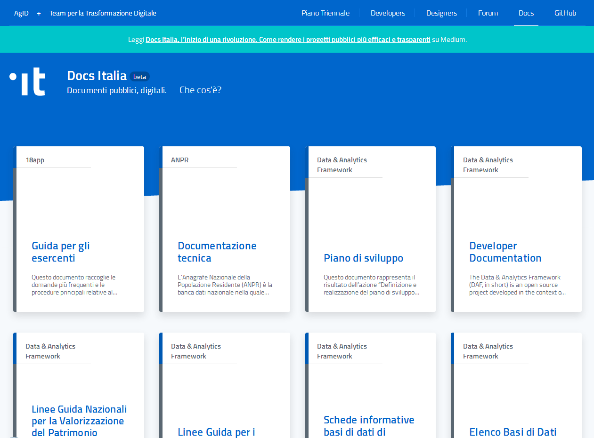
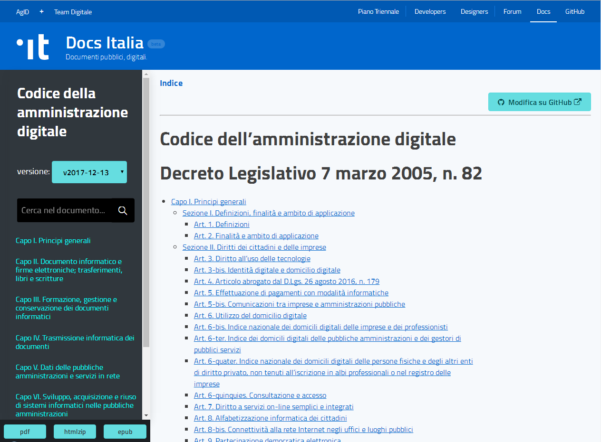
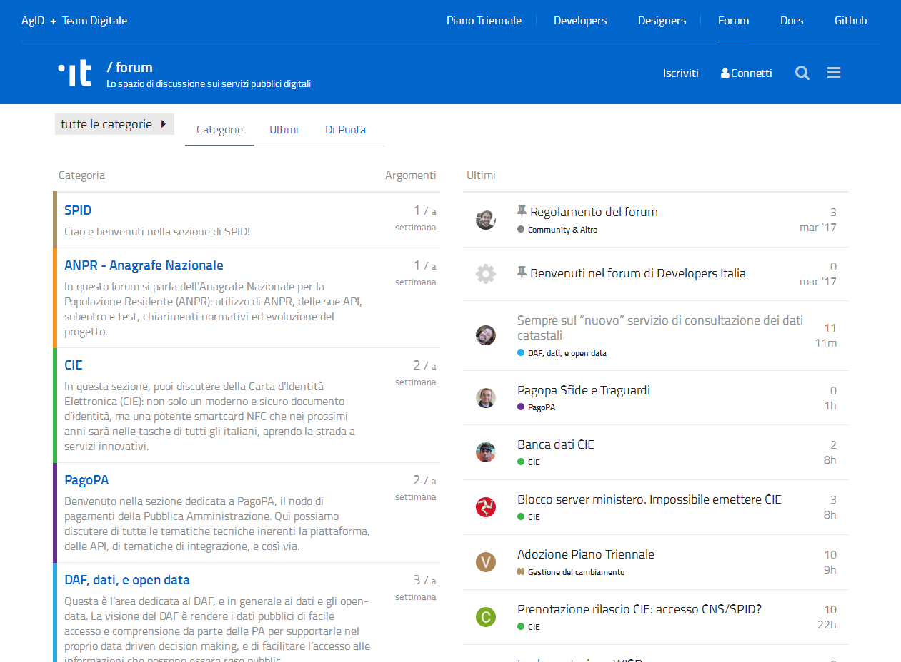

DOCUMENTAZIONE DIGITALE
=======================

`Perché? <http://come-creare-guida.readthedocs.io/it/latest/#perche-questo-tutorial>`__
---------------------------------------------------------------------------------------

“L’obiettivo prioritario è far in modo di diminuire le pubblicazioni online in formato PDF, che oggi rappresenta il formato più usato nei siti web della PA, ma che non consente una leggibilità nei dispositivi mobili (viene molto difficile e non è affatto pratico) e che non permette un’agevole ricerca di parole nel testo, inoltre rendere complessa la modalità di partecipazione. Il formato Read the Docs, invece, soddisfa i suddetti requisiti” [1]_

.. raw:: html

   

`Cos’è Docs italia? <https://docs.developers.italia.it/che-cos-e-docs-italia/>`__\ |image4|

.. raw:: html

   

**Figura 5: Pagina di Docs Italia**

`Docs Italia <https://docs.developers.italia.it/>`__ è un servizio a disposizione delle Pubbliche Amministrazioni per pubblicare documenti tecnici e amministrativi, e offre ai cittadini la possibilità di leggere e commentare documenti pubblici ed essere informati sull’andamento dei progetti.

Su Docs Italia trovi:

-  documentazione tecnica relativa ai progetti pubblici

*Per esempio, su Docs Italia è possibile accedere alla documentazione relativa al progetto per costruire l’*\ `Anagrafe nazionale della popolazione residente in Italia <https://anpr.readthedocs.io/en/latest/>`__

-  documenti amministrativi, circolari, linee guida, regole tecniche, direttive

*Per esempio, su Docs Italia è disponibile il *\ `Codice dell’Amministrazione Digitale <https://cad.readthedocs.io/>`__\ **,**\ *la legge che definisce il ruolo del digitale nella Pubblica Amministrazione*

.. _principi-1:

Principi
--------

Docs Italia si ispira a cinque principi, funzionali a costruire un linguaggio comune di gestione dei progetti pubblici:

-  il primo è che oggi, in tutto il mondo, i documenti non sono più il prodotto di un individuo e di un ufficio, ma sono sempre di più il frutto di una collaborazione che prevede il contributo di diverse persone e diversi profili professionali, tecnici, economici e amministrativi;
-  il secondo è che la Pubblica Amministrazione, seguendo una filosofia di open government, tende a incoraggiare il contributo della comunità e di punti di vista esterni;
-  il terzo è che la Pubblica Amministrazione ha bisogno di modalità comuni per gestire le informazioni relative a un progetto, dalle linee guida di indirizzo alla documentazione tecnica;
-  il quarto è che i documenti non sono un oggetto statico, scolpito nella pietra o stampato nella carta, ma evolvono nel tempo: poter tenere traccia di questa evoluzione offre diversi vantaggi;
-  il quinto è che i documenti vengono fruiti sempre più spesso su Internet, e in particolare su smartphone: la semplicità di lettura fa la differenza.

Docs Italia ha queste caratteristiche:
--------------------------------------

-  **Collaborazione**

Docs Italia consente un processo di pubblicazione e di modifica di tipo collaborativo: tutti possono proporre contributi e suggerimenti ai documenti.

-  **Consultazione pubblica**

Secondo una filosofia \ **open government**, Docs Italia consente di gestire il \ `processo di consultazione pubblica di un documento amministrativo <http://cad.readthedocs.io/it/v2017-12-13/_rst/capo1_sezione3_art18.html?highlight=consultazione%20pubblica>`__ previsto dall’art. 18 del Codice dell’Amministrazione digitale.

`Qui un esempio <http://cloud-pa.readthedocs.io/>`__

-  **Un luogo unico**

Docs Italia vuole diventare il luogo che offre una visione di insieme sui progetti pubblici in corso, affiancando gli aspetti tecnologici e quelli amministrativi (leggi: la documentazione tecnica e le circolari in un unico luogo!)

-  **I documenti evolvono!**

Docs Italia (utilizzando il version control system di GitHub, \ `basato su Git <https://it.wikipedia.org/wiki/Git_(software)>`__) mette a disposizione un sistema che consente di tenere traccia della storia di un documento e mantenerne tutte le versioni, permettendo di confrontarle fra loro.

-  **Facilità di lettura, anche sullo smartphone**

I documenti di Docs Italia hanno un indice ben strutturato, un motore di ricerca efficace e sono di facile lettura, anche sullo smartphone.

`Guida a Docs Italia <http://guida-docs-italia.readthedocs.io/it/latest/>`__

I principi di Docs Italia sono pienamente in sintonia con la politica di e-government garantendo allo stesso tempo servizi fondamentali come il *mobile first,* l’accessibilità e la partecipazione.

Accessibilità e *mobile first*
------------------------------

ReadTheDocs è una piattaforma di condivisione di documenti di testo in html, organizzata secondo una classica divisione in capitoli e sezioni e un indice laterale di scorrimento dei capitoli stessi, che permette la fruizione del documento su ogni dispositivo in maniera fluida e con una agevole funzione di ricerca, con la quale è stato creato Docs, il nuovo sistema di gestione dei documenti pubblici.

|image5|

**Figura 6: versione ReadTheDocs del CAD**

La partecipazione - Discourse
-----------------------------

Discourse è uno strumento di collaborazione utilizzato dalla comunità di sviluppatori come forum di discussione, chat, mailing list, con il quale è stato creato `Forum Italia <https://forum.italia.it/>`__, il forum di discussione sui servizi pubblici, per poter fornire supporto alle amministrazioni.

|image6|

**Figura 7: Home page del Forum Italia**

La partecipazione – Hypothes.is
~~~~~~~~~~~~~~~~~~~~~~~~~~~~~~~

Uno strumento utile ad attivare la partecipazione comodo e utile è

.. _section-2:

Linguaggio e formati usati
--------------------------

Il linguaggio utilizzato per creare la documentazione digitale è un linguaggio definito di “markup”; ossia un insieme di regole che descrivono i meccanismi di rappresentazione di un testo che, attraverso l’utilizzo di convenzioni standardizzate, è utilizzabile su più supporti.

| Il reStructuredText è il linguaggio di markup utilizzato per pubblicare documentazione digitale attraverso la piattaforma ReadTheDocs, esso è caratterizzato da una elevata leggibilità a livello di codice sorgente.
| I file scritti con il seguente linguaggio di markup hanno l'estensione .rst

Strumenti agevoli per la realizzazione sono oggetto già da tempo del lavoro del Team per l’Italia Digitale ma esistono attualmente delle ottime e pratiche soluzioni alla realizzazione di file Rst

`da “Google Docs” a “Read the Docs” senza fermate intermedie <http://googledocs.readthedocs.io/it/latest/>`__

**La Città Metropolitana di Napoli ha scelto, quindi, di adottare la documentazione digitale per la pubblicazione delle seguenti Linee Guida Open Data auspicandosi, che in futuro si adotti la medesima modalità in pubblicazioni quali: regolamenti, codici di comportamento, linee guida, atti di rilevanza pubblica e di tutta la documentazione rientrante nelle categorie indicate da Docs Italia per la Pubblica Amministrazione.**

.. [1]
   http://come-creare-guida.readthedocs.io/it/latest/

